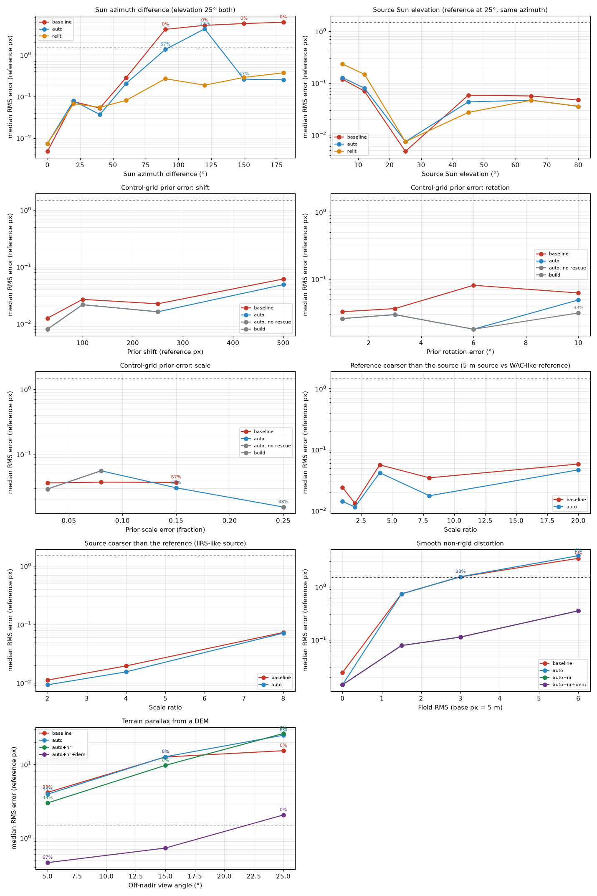

# Selenograph

Image registration of Chandrayaan-2 optical products (OHRC, TMC-2, IIRS) to LRO reference mosaics, with a
desktop application.

Source and reference images differ in illumination (Sun azimuth and elevation), viewing geometry (off-nadir
views, push-broom jitter, terrain parallax) and scale (0.25 m OHRC to 100 m WAC). Selenograph estimates the
transform that maps the source onto the reference, reports how far to trust it, and reports **No fit** when the
evidence is not good enough.

Smart India Hackathon 2026, problem statement 26166.

## Contents

- [Features](#features)
- [Installation](#installation)
- [Using the app](#using-the-app)
- [Data](#data)
- [How it works](#how-it-works)
- [Project configuration](#project-configuration)
- [Running from source](#running-from-source)
- [Local API](#local-api)
- [Benchmark](#benchmark)
- [Building a release](#building-a-release)
- [Repository layout](#repository-layout)
- [Limitations](#limitations)

## Features

- Registers a source strip to a reference mosaic starting from the product's own control grid, then refines
  it with dense, tile-by-tile correlation.
- Handles Sun-angle changes by choosing, per scene, the image representation on which the tiles agree most
  (intensity, gradient magnitude or oriented-gradient channels), and optionally by correlating against the DEM
  re-lit at the source's Sun angle.
- Models terrain parallax from a DEM and a smooth non-rigid residual field, and keeps each only when
  cross-validation shows it predicts held-out tiles better.
- Reports RMSE and a cross-validated held-out RMSE in metres, inlier counts, and a set of sanity checks.
- Writes a georeferenced registered GeoTIFF, tie points (lon, lat) and the transform for every run.
- Desktop app with project list, results viewer (side-by-side images, overlays, plots, metrics) and a
  benchmark viewer.

## Installation

### Windows application

Download `Selenograph-windows-x64.zip` from the
[Releases](../../releases) page, unzip it and run `Selenograph.exe`. Windows 10 or 11 (64-bit); about 415 MB
installed. Python is not required: the registration service is bundled and starts hidden on a private local
port when the app opens, and stops when the app closes. The first start takes about 20 seconds.

Projects and results are stored in `%LOCALAPPDATA%\Selenograph`. Source and reference imagery is not included;
see [Data](#data).

## Using the app

1. **File > New project.** Choose the source product folder, press *Fill from source* to take the area of
   interest from the product footprint (edit the numbers to narrow it), and choose the reference GeoTIFF.
   A DEM is optional.
2. **Open the project, press Run.** The banner shows the stage and elapsed time.
3. **View results.** The images sit side by side. The inspector on the right shows the metrics, the sanity
   checks and how the match was made. A run that could not be trusted is shown as No fit with the reason.

## Data

The app does not ship imagery. A project needs a source product and a reference mosaic.

| Role | Product | Where |
|---|---|---|
| Source | Chandrayaan-2 OHRC, TMC-2, IIRS (PDS4, with its `geometry/` folder) | [ISSDC PRADAN](https://pradan.issdc.gov.in/ch2/protected/payload.xhtml) (account required) |
| Reference | LRO NAC / WAC mosaics (georeferenced GeoTIFF) | [LROC QuickMap](https://quickmap.lroc.im-ldi.com/), [NASA Moon Trek](https://trek.nasa.gov/moon/), [LROC archive](https://wms.lroc.asu.edu/lroc/rdr_product_select) |
| DEM (optional) | LOLA elevation models | [global 118 m](https://planetarymaps.usgs.gov/mosaic/Lunar_LRO_LOLA_Global_LDEM_118m_Mar2014.tif), [south polar 20 m](https://pgda.gsfc.nasa.gov/data/LOLA_20mpp/LDEM_80S_20MPP_ADJ.TIF) |

Helper scripts in `algo/scripts/` download and window this data: `download_chandrayaan2.py`,
`download_lro_reference.py`, `fetch_wac_reference.py`, `fetch_trek_polar_nac.py`, `fetch_lola_dem_window.py`
and `fetch_lola_global_window.py`. Downloaded data lives under `data/` and is not committed.

## How it works

```
config -> crop to AOI -> control-grid prior H0 -> staged tile matching -> robust fit per stage
       -> full model (homography + parallax + non-rigid field) -> metrics and checks -> GeoTIFF
```

1. **Crop.** The source is cut to the area of interest through its control grid (line, sample to lat, lon) and
   block-averaged to about the reference resolution. The matching reference window is cut from the mosaic.
2. **Prior.** Control-grid points inside the crop give least-squares homography `H0` from source pixels to
   reference pixels. It is only as good as the product's pointing (a few hundred metres), so the problem
   reduces to measuring a small residual shift, not searching the whole reference.
3. **Tile matching.** Each stage covers the overlap with tiles. Each tile is resampled through the current
   transform and correlated against the reference inside a search window with zero-mean normalised
   cross-correlation,

   `rho(s) = sum (f - mean_f)(t - mean_t) / sqrt(sum (f - mean_f)^2 * sum (t - mean_t)^2)`,

   on an illumination-robust representation. The peak, refined to sub-pixel by a parabola fit, is the tile's
   residual shift. A first capture stage chooses the representation by how many tiles agree on one global
   shift. Window and tile size shrink from stage to stage.
4. **Robust fit.** Each stage fits an affine update with RANSAC (and a least-squares homography when the
   inliers span the strip) and uses the result as the next stage's prior.
5. **Full model.** The final model is a homography, an optional DEM parallax term (two coefficients, solved by
   least squares) and a thin-plate-spline displacement field. The field's smoothing is chosen by spatially
   blocked cross-validation and the field is adopted only if it beats the homography on held-out data.
   Inliers are re-selected against the full model with a threshold built from the median absolute deviation.
6. **Metrics.** RMSE is the inlier residual in reference pixels times the reference GSD. The held-out RMSE is
   the blocked cross-validation error and is the figure to trust. Sanity checks (scale against the GSD ratio,
   distinct anchors, steady offset from the prior) are shown with the results.

There is no learned model in this pipeline.

## Project configuration

One YAML file per project in `algo/configs/`; `algo/configs/default.yaml` documents every field. The app
writes these files for you. Project files are local (they point at imagery on your machine) and are not
tracked by git.

## Running from source

Requirements: Python 3.11, Flutter 3.x with Windows desktop support.

```powershell
cd algo
py -3.11 -m venv .venv
.venv\Scripts\python.exe -m pip install -r requirements.txt
.venv\Scripts\python.exe -m pip install -e .

# register one project from the command line
.venv\Scripts\python.exe -m algo.pipeline --config configs\<project>.yaml

# tests
.venv\Scripts\python.exe -m pytest

# local API used by the desktop app
.venv\Scripts\python.exe -m algo.api.server
```

```powershell
cd desktop
flutter run -d windows
flutter test
```

In development the app looks for `algo\.venv` next to it and starts the API server itself.

## Local API

The server listens on `127.0.0.1` (port 8000 when started by hand; the packaged app picks a free port).

| Method and path | Purpose |
|---|---|
| `GET /health` | liveness check |
| `GET /configs`, `POST /configs` | list projects, create a project |
| `GET /configs/{name}/details` | facts read from the products (pixel size, Sun angles, geometry) |
| `GET /configs/{name}/preview.png` | source and reference preview |
| `GET /footprint?path=` | lat/lon bounds of a source product |
| `POST /runs`, `GET /runs`, `GET /runs/{id}` | start a run, list runs, read one run |
| `GET /runs/{id}/overlay.png` | match overlay |
| `GET /runs/{id}/viz`, `GET /runs/{id}/viz/{name}.png` | result plots and sanity checks |
| `GET /benchmarks` | synthetic benchmark summary |

## Benchmark

`algo/src/algo/benchmark/` generates synthetic scenes with a known ground-truth transform and sweeps one
difficulty at a time (Sun azimuth, viewpoint, prior error, scale) through the same code the application runs.

```powershell
cd algo
.venv\Scripts\python.exe -m algo.benchmark.suites illumination   # or viewpoint | prior | scale | combined
.venv\Scripts\python.exe -m algo.benchmark.report                # writes the summary, docs/benchmark.md and chart
```



## Building a release

```powershell
# 1. registration service (PyInstaller, no Python needed to run it)
cd build_pkg
.\build_server.ps1

# 2. desktop app
cd ..\desktop
flutter build windows --release
```

Copy `desktop\build\windows\x64\runner\Release\*` into a folder, rename the executable to `Selenograph.exe`,
copy `build_pkg\dist\selenograph-server` into it as `server\`, and zip the folder.

## Repository layout

```
algo/
  src/algo/
    preprocessing/   control grid, PDS4 metadata, crops
    illumination/    DEM re-lighting
    matching/        tile matcher, image representations, correlation
    geometry/        homography analysis, parallax, non-rigid field, full-model fit
    registration.py  one entry point: match, fit, re-select inliers
    pipeline.py      one project end to end
    evaluation/      metrics
    export.py        registered GeoTIFF and tie points
    api/             local FastAPI server, plots, previews
    benchmark/       synthetic benchmark
  configs/           project configuration template
  scripts/           data download helpers, batch runner
  tests/
desktop/             Flutter app
build_pkg/           release packaging script
website/             project website (static)
docs/                benchmark chart
```

## Limitations

- Accuracy is limited by the reference. Against a 100 m WAC mosaic the error is tens of metres; against a
  4-5 m NAC mosaic it is a few metres. There is no ground truth for real pairs, so the held-out RMSE is the
  honest figure.
- A source with no usable contrast (shadowed or unlit strip) or with too little overlap with the reference
  gives No fit.
- A product needs a control grid (or label corner coordinates) so that the prior exists.
- Windows is the only supported platform for the packaged app.
